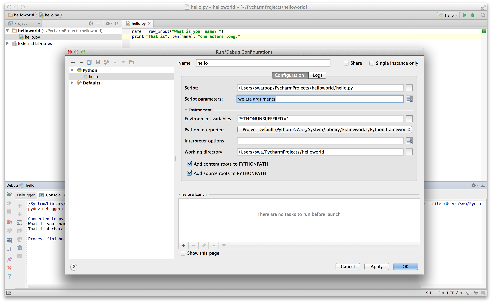

# Основи

Просто надрукувати `Привіт, Світ!` недостатньо, чи не так? Ви хочете зробити більше, ніж це – ви хочете ввести щось у програму, обробити та отримати щось на виході. Ми можемо досягти цього в Python за допомогою констант і змінних, і ми також вивчимо деякі інші концепції в цьому розділі.

## Коментарі

_Коментарі_ – це будь-який текст,що пишеться після символу `#` і в основному корисний як примітки для читача програми.

Наприклад:

```python
print('Привіт, Світ!') # Зауважте, що print — це функція
```

або:

```python
# Зауважте, що print — це функція
print('Привіт, Світ!')
```

Використовуйте якомога більше корисних коментарів у своїй програмі, щоб пояснювати:

- припущення;
- важливі рішення;
- важливі деталі;
- проблеми, які ви намагаєтеся вирішити;
- проблеми, які ви намагаєтеся подолати у своїй програмі тощо.

[*Код програми підкаже вам, ЯК, а коментарі мають розповісти вам, ЧОМУ*](http://www.codinghorror.com/blog/2006/12/code-tells-you-how-comments-tell-you-why.html).

Це корисно для читачів вашої програми, щоб вони могли легко зрозуміти, що робить програма. Пам'ятайте, що такою людиною можете виявитися ви самі через півроку!

## Літеральні константи

Прикладом літеральної константи є числа, такі як `5`, `1,23`, або рядок, як-от ``Це рядок`` або `"It's a string!»`.
Вони називаються літеральними, тому що вони _буквальні_ - ви використовуєте їхнє значення буквально.Число `2` завжди представляє саме себе і нічого іншого - це _константа_, оскільки ії значення не можна змінити. Отже, усі вони називаються літеральними константами.

## Числа

Числа в основному бувають двох типів - цілі("integers") і з рухомою комою ("floating point numbers" (or "floats" for short)).

Прикладом цілого числа ("integer") може служити "2", яке є цілим числом.

Прикладами чисел з рухомою комою можуть бути `3.23` і `52.3E-4`. Позначення E показує ступеня числа 10. У цьому випадку "52,3E-4" означає "52,3 * 10^-4^".

РІЗНИЦЯ між поняттями «Рухома кома» та «Рухома крапка»*(від перекладача).
Оскільки в деяких, переважно в  Америці та англомовних країнах при запису чисел ціла частина відділяється від дробової крапкою (Decimal Point), то в термінології цих країн фігурує назва «рухома крапка» (англ. floating point).
В Европейських країнах,як і в Україні, ціла частина числа від дробової традиційно відділяється комою (Decimal Comma), то для позначення того ж поняття історично використовується термін «рухома кома» (англ. floating comma), проте в літературі та технічній документації можна зустріти обидва варіанти. 
У програмуванні Python використовується при позначені числа з рухомою комою _крапка_.

> **Примітка для досвідчених програмістів**
>
> На відміну від інших мов програмування (наприклад, C, Java тощо), число _int_ на мові Python не має верхньої межі.

## Pядки

Рядок — це послідовність символів. Найчастіше рядки - це просто набір слів.

Ви будете використовувати рядки майже в кожній програмі на мові Python, яку пишете, тому зверніть увагу на наступну частину.

### Одинарні лапки

Ви можете вказати рядки, використовуючи одинарні лапки, наприклад `'Фраза в лапках'`.

Усі пробіли та знаки табуляції, зберігаються як є.

### Подвійні лапки

Рядки в подвійних лапках працюють точно так само, як рядки в одинарних лапках. Приклад: `"Як тебе звуть?"`.

### Потрійні лапки 

Ви можете вказати багаторядкові рядки, використовуючи потрійні лапки - (`"""` або `'''`). Ви можете вільно використовувати одинарні та подвійні лапки в потрійних лапках. Приклад:

```python
'''Це багаторядковий рядок.Це перший рядок.
Це другий рядок.
«Як тебе звати?», — запитав я.
Він сказав «Бонд, Джеймс Бонд».
'''
```

### Рядки незмінні

Це означає, що коли ви створили рядок, ви не можете його змінити. На перший погляд це може показатися недоліком, насправді це не так. Пізніше,на прикладі різних програм,ми побачимо, чому це не є обмеженням.

> **Примітка для програмістів C/C++**
> 
> У Python немає окремого типу даних `char`. У цьому немає справжньої потреби, і я впевнений, що ви не нудьгуватимете за ним.

<!-- -->

> **Примітка для програмістів Perl/PHP**
> 
> Пам’ятайте, що рядки в одинарних лапках і рядки в подвійних лапках однакові – вони нічим не відрізняються.

### Метод форматування ("The format method")

Іноді нам може знадобитися побудувати рядки на основі будь-яких даних. Ось де корисний метод `format()`.

Завантажуйте наступні рядки як файл `str_format.py`:
(Примітка від перекладача:
1.пунктуація,як апостроф,двокрапка тощо, не можно використовувати у змінних (variables), тільки підкреслення "_" 
2.`Swaroop` - Swarrop Chitlur - aвтор книги ("Bite of Python"– «Укус Пітона») 

```python
вік = 20
ім_я = 'Swaroop'

print('{0} було {1} років, коли він написав цю книгу'.format(ім_я, вік))
print('Чому {0} грає з цим Рython?'.format(ім_я))
```

Висновок:

```
$ python str_format.py
Swaroop було 20 років, коли він написав цю книгу.
Чому Swaroop грає з цим Рython?
```

**Як це працює**

Рядок може використовувати певні позначення, і згодом можна викликати метод `format`, щоб замінити ці позначення відповідними аргументами в метод `format`.

Зверніть увагу на перший випадок, коли ми використовуємо `{0}`, і це відповідає змінній `ім_я`, яка є першим аргументом методу format. Подібним чином другe позначення — це `{1}`, що відповідає змінній `вік`, яка є другим аргументом методу format. Зверніть увагу, що Python починає відлік з 0, що означає, що перша позиція знаходиться в індексі 0, друга позиція в індексі 1 і так далі.

Зверніть увагу, що ми могли б досягти того ж, використовуючи об'єднання рядків:

```python
ім_я + ' є ' + str(вік) + ' років'
```
але це набагато гірше та більше схильне до помилок. По-друге, перетворення в рядок буде виконано автоматично за допомогою методу `format` на відміну від явного перетворення в нашому прикладі. По-третє, використовуючи метод `format`, ми можемо змінити повідомлення, не торкаючись використовуваних
змінних, і навпаки.

Також зауважте, що числа є необов’язковими, тому ви також можете записати так:

```python
вік = 20
ім_я = 'Swaroop'

print('{} було {} років, коли він написав цю книгу'.format(ім_я, вік))
print('Чому {} грає з цим  Python?'.format(ім_я))
```

та отримати такий самий результат, як і раніше.

Ми також можемо назвати параметри (де вік,ім_я є параметрами):

```python
вік = 20
ім_я = 'Swaroop'

print('{ім_я} було {вік} років, коли він написав цю книгу'.format(ім_я=ім_я, вік=вік))
print('Чому {ім_я} грає з цим Рython?'.format(ім_я=ім_я))
```

та отримати такий самий результат, як і раніше.
 
Python 3.6 представив коротший спосіб створення іменованих параметрів, який називається «f-strings»:

```python
вік = 20
ім_я = 'Swaroop'

print(f'{ім_я} було {вік} років, коли він написав цю книгу')  # зверніть увагу на 'f' перед рядком
print(f'Чому {ім_я} грає з цим Рython?')  # зверніть увагу на 'f' перед рядком
```

та отримати такий самий результат, як і раніше.

Те, що Python робить у методі `format`, полягає в тому, що він поміщає значення кожного аргументу(більш детальніше пояснення про аргументи та параметри пізніше) в зазначене місце. Можуть бути більш детальні позначення, такі як (для отримання додаткової інформації дивіться документацію https://docs.python.org/3/library/string.html#formatspec):

```python
# десяткове число (.) з точністю в 3 знаки для числа з рухомою комою '0.333'
print('{0:.3f}'.format(1.0/3))
# заповнити підкресленнями (_) з центруванням тексту
# (^) по ширині 11: '___привіт___'
print('{0:_^11}'.format('привіт'))
# на основі ключових слів 'Swaroop написав «Укус Пітона»'
print('{ім_я} написав {книга}'.format(ім_я='Swaroop', книга='Укус Пітона'))
```

Висновок:

```
0.333
___привіт___
Swaroop написав Укус Пітона

```

Оскільки ми обговорюємо форматування, зауважте, що `print` завжди закінчується невидимим символом «нового рядка» (`\n`), тому повторні виклики `print` будуть виводитися з нового рядка.Фактично print() виводить вказане значення,а після цього переводить курсор на наступний рядок.  Щоб запобігти друку  символу нового рядка, ви можете вказати, що він повинен закінчуватися без пробілів:

```python
print('a', end='')
print('b', end='')
```

Висновок:

```
ab
```

Або ви можете завершити `пробілом`:

```python
print('a', end=' ')
print('b', end=' ')
print('c')
```

Висновок:

```
a b c
```

### Escape Sequences (екранована послідовность,символ \ (зворотній слеш))

Припустімо, ви хочете мати рядок, який містить одинарну лапку (`'`), як ви вкажете цей рядок? Наприклад, рядок є`"Як Ваше ім'я?"`. Ви не можете вказати `'Як Ваше ім'я?'` тому що Python заплутається щодо того, де починається і де закінчується рядок. Отже, вам доведеться вказати, що ця одинарна лапка не вказує на кінець рядка. Це можна зробити за допомогою так званої _escape sequence_("_екранована послідовность_"). Ви вказуєте одинарну лапку як `\'`: зверніть увагу на зворотній слеш. Тепер ви можете вказати рядок як`'Як Ваше ім\'я?'`.

Іншим способом вказати цей конкретний рядок буде `"Як Ваше ім'я?"`, тобто використовуючи подвійні лапки.Подібним чином, ви повинні використовувати escape sequence("екрановану послідовность",символ \ (зворотній слеш)) для позначення подвійних лапок всередині рядку з подвійними лапками.Приклад від перекладача:

```python
# цей варіант не працює, оскільки подвійні лапки знаходяться всередині рядка подвійних лапок:
print("Мова програмування "Python" займає у моєму серці важливе місце.")

# цей варіант спрацює, оскільки подвійні лапки навколо слова Python екрановані:
print("Мова програмування\"Python\" займає у моєму серці важливе місце." )
```

Ви також можете вказати подвійний зворотній слеш за допомогою escape sequence `\\`.
Приклад від перекладача:

```python
#  \n — це екранована послідовність для нового рядка
#  \f — form feed - йде на один рядок нижче
# це речення буде виводитися у три рядки,але з нюансами:
print("мої фотографії збережено на  диску c:\new_pictures\foto.jpg")

# Висновок:
мої фотографії збережено на  диску c:
ew_pictures
           oto.jpg
 
# щоб надрукувати речення правильно, треба використати подвійний зворотній слеш:
print("мої фотографії збережено на  диску c:\\new_picture\\foto.jpg")
# Висновок:
мої фотографії збережено на  диску c:\new_picture\foto.jpg

```

Що, якби ви хотіли вказати дворядковий рядок? Одним із способів є використання рядка в потрійних лапках, як показано [раніше] (#Потрійні лапки) або ви можете використати escape sequence("екрановану послідовность")) для символу нового рядка - `\n`, щоб вказати початок нового рядка. Наприклад:  

```python
'Це перший рядок\nЦе другий рядок'
```
Висновок:

```
Це перший рядок
Це другий рядок
```
Приклад від перекладача
``` python
# з потрійними лапками
вірш1 = """я можу бути програмістом 
і мова Python потрібна звісно."""
print(вірш1)
# з екранованої послідовностю \n
вірш2 = "я можу бути програмістом\nі мова Python потрібна звісно."
print(вірш2)

# Висновок:
я можу бути програмістом
і мова Python потрібна звісно.
```
Ще одна корисна  escape sequence ("екрановану послідовность"), про яку слід знати, це послідовність символів:`\t`(розглядається як один символ табуляції ). Існує ще багато   escape sequences, але я згадав тут лише найкорисніші.


Варто зауважити, що зворотній слеш в кінці рядка означає, що рядок продовжується в наступному рядку, але новий рядок не додається. Наприклад:

```python
"Це перше речення. \
Це друге речення."
```

еквівалентно

```python
"Це перше речення. Це друге речення."
```

### Raw String ("необроблений рядок")

Якщо вам потрібно вказати деякі рядки, де не обробляються  спеціальні символи, наприклад escape sequences ("екранована послідовность"), тоді вам потрібно вказати _raw_stri("_необроблений_рядок"), додавши до рядка префікс `r` або `R`.Необроблений рядок Python розглядає символ зворотної похилої риски (\) як буквальний символ.Наприклад:

```python
r"Нові рядки позначаються \n"
```

> **Примітка для користувачів  Regular Expression User(регулярного виразу)** 
> 
>Завжди використовуйте raw strings ("необроблені рядки")під час роботи з регулярними виразами. Інакше може знадобитися чимало зворотних слешей. 
Наприклад, абревіатуру з регулярними виразами в Python можна знайти за допомогою  `'\\1'` or `r'\1'` (на відміну роботи з Python, пошук  абревіатуру з регулярними виразами в інших системах виконується символом `\1`)

## Змінні

Використання лише літеральних констант незабаром може набриднути — нам потрібен якийсь спосіб зберігання будь-якої інформації та маніпулювання нею. Ось тут і з’являються _змінні_. Змінні — це саме те, що випливає з назви — їхнє значення може змінюватися, тобто ви можете зберігати будь-що за допомогою змінної. Змінні — це лише частини пам’яті комп’ютера, де зберігається деяка інформація. На відміну від літеральних констант, вам потрібен певний метод доступу до цих змінних і, отже, ви даєте їм імена.

## Іменування ідентифікатора

Змінні є прикладами ідентифікаторів. _Ідентифікатори_ — це імена, надані для ідентифікації _чогось_ для його позначення. Існують деякі правила, яких слід дотримуватися для ідентифікаторів імен:

- Першим символом ідентифікатора має бути літера алфавіту (символ ASCII в
верхньому(великі літери) або нижньому(малі літери) регістрі, або символ Unicode), а також знак підкреслення(`_`).
- Решта назви ідентифікатора може складатися з літер (символ ASCII в
верхньому або нижньому регістрі, або символ Unicode),знак підкреслення (`_`) або цифр (0-9).
- Імена ідентифікаторів чутливі до регістру. Наприклад, `myname` і `myName` _не_ те саме. Зверніть увагу на `n`у нижньому регістрі у першому випадку та на `N` у верхньому регістрі у другому випадку.
- Прикладами _допустимих_ імен ідентифікаторів є `i`, `name_2_3`. Прикладами _неприпустимих_ імен ідентифікаторів є `2things`, `this is spaced out`, `my-name` і `>a1b2_c3`.

## Типи даних

Змінні можуть містити значення різних типів, які називаються _типами даних_.Основними типами є числа та рядки, які ми вже обговорювали. У наступних розділах ми побачимо, як створювати власні типи за допомогою [класів](./oop.md#classes).

## Об'єкт

Пам’ятайте, Python називає все, що використовується в програмі, _об’єктом_.Це мається на увазі в загальному значенні. Замість того, щоб говорити "_щось_"', ми говоримо "_об'єкт_".

> **Примітка для користувачів об’єктно-орієнтованого програмування**:
>
> Python сильно об’єктно-орієнтований у тому сенсі, що все є об’єктом, включаючи числа, рядки та функції.

Тепер ми побачимо, як використовувати змінні разом із літеральними константами. Збережіть наступний приклад і запустіть програму.

## Як писати програми на Python

Відтепер стандартна процедура збереження та запуску програми Python така:

### For PyCharm

1. Відкрийте [PyCharm](./first_steps.md#pycharm).
2. Створіть новий файл з назвою файлу.
3. Введіть програмний код, наведений у прикладі.
4. Клацніть правою кнопкою миші та запустіть поточний файл.

ПРИМІТКА. Щоразу, коли вам потрібно надати [command line arguments ("аргументи командного рядка")](./modules.md#modules), натисніть кнопку`Run` -> `Edit Configurations`, введіть аргументи в розділ `Script parameters:` і натисніть кнопку `OK`:



### Для інших редакторів

1. Відкрийте вибраний редактор.
2. Введіть програмний код, наведений у прикладі.
3. Збережіть його як файл з назвою файлу.
4. Запустіть інтерпретатор командою `python program.py`, щоб запустити програму.

### Приклад: використання змінних і літеральних констант

Введіть і запустіть таку програму:

```python
# Ім'я файлу : var.py
i = 5
print(i)
i = i + 1
print(i)

s = '''Це багаторядковий рядок.
Це другий рядок.'''
print(s)
```

Висновок:

```
5
6
Це багаторядковий рядок.
Це другий рядок.
```

**Як це працює**

Ось як працює ця програма. Спочатку ми привласнюємо значення константи `5` змінній `i` за допомогою оператора присвоювання (`=`).Цей рядок називається statement - так би мовити
"інструкція рoботи для комп'ютера".
Вираз і=5 має три частини:
1. "і" - назва змінної;
2. "=" - оператор присвоювання;
3. "5" - літеральна константа.
Ці частини не працюють поодинці,але разом вони створюють інструкцію рoботи для комп'ютера. Така інструкція,яку комп'ютер може зрозуміти називається "statement".
Цей рядок називається statement,оскільки в ньому зазначено, що потрібно щось зробити, і в цьому випадку ми з’єднуємо назву змінної `i` зі значенням `5`.Далі ми друкуємо значення `i` за допомогою функції `print`, яка, як не дивно, просто виводить значення змінної на екран.

Потім ми додаємо «1» до значення, збереженого в «i», і зберігаємо його там. Потім ми друкуємо його і, як очікується, отримуємо значення "6".

Подібним чином ми присвоюємо рядковий літерал змінній `s`, а потім друкуємо його.

> **Примітка для програмістів статичної мови**
> 
> Змінні використовуються простим наданням їм значень. Ніякого попередньоного оголошення або визначення типу даних не потрібно/застосовується.

## Логічні та фізичні рядки

Фізична лінія - це те, що ви _бачите_, коли пишете програму. Логічний рядок — це те, що _Python сприймає_ як "a single statement" ("одну інструкцію "). Python неявно припускає, що кожен _фізичний рядок_ відповідає _логічному рядку_.

Прикладом логічного рядка є statement `print('Привіт, Світ!')`- якщо воно в одному рядку(як ви бачите це в редакторі), то цей рядок також відповідає фізичному рядку.

Неявно Python заохочує використання одного statement на рядок, що робить код більш читабельним.

Якщо ви хочете вказати більше ніж один логічний рядок в одному фізичному рядку, ви повинні явно вказати це за допомогою крапки з комою (`;`), яка вказує на кінець логічного рядка/statement. Наприклад:

```python
i = 5
print(i)
```

те саме, що

```python
i = 5;
print(i);
```
і те саме може бути записано у вигляді

```python
i = 5; print(i);
```
або

```python
i = 5; print(i)
```

Однак я *настійно рекомендую* вам дотримуватися *написання максимум одного логічного рядка в кожному фізичному рядку*. Ідея полягає в тому, що ви можете обійтися без крапки з комою. Фактично, я _ніколи_ не використовував і навіть не бачив крапку з комою в програмі Python.


Існує одна ситуація, коли ця концепція дійсно корисна: якщо у вас є довгий рядок коду, ви можете розбити його на кілька фізичних рядків, використовуючи зворотній слеш. Це називається _явним з’єднанням рядків (англ."explicit line joining")_:

```python
s = 'Це рядок. \
Цей рядок продовжується.'
print(s)
```

Висновок:

```
Це рядок. Цей рядок продовжується.
```

Аналогічно,

```python
i = \
5
```

те саме, що

```python
i = 5
```

Іноді існує неявне припущення, що вам не потрібно використовувати зворотній слеш. Це випадок, коли в логічному рядку є відкриваюча кругла, квадратна або фігурна дужка, але немає закриваючої . Це називається *неявним з’єднанням ліній* (англ."implicit line joining") . Ви можете побачити це в дії, коли ми пишемо програми за допомогою [list](./data_structures.md#lists) у наступних розділах.

## Bідступи (Indentation)
Пробіли ("Whitespace")важливі в Python. Точніше *пробіли на початку рядка важливі*. Це називається _відступами_(_indentation_). Передні відступи (пробіли та табуляції) на початку логічного рядка використовуються для визначення рівня відступу логічного рядка, який, у свою чергу, використовується для групування statement.

Це означає, що statement, які йдуть разом, _повинні_ мати однаковий відступ. Кожен такий набір statement називається *блоком*. У наступних розділах ми побачимо приклади важливості блоків.

Пам’ятайте, що неправильний відступ може спричинити помилки. Наприклад:

```python
i = 5
# Помилка нижче! Зверніть увагу на один пробіл на початку рядка
 print('Значення є', i)
print('Я повторюю, значення є', i)
```

Коли ви запускаєте це, ви отримуєте таку помилку:

```
  File "whitespace.py", line 3
    print('Значення є', i) # Помилка! Пробіл на початку рядка
    ^
IndentationError: unexpected indent
```

Зверніть увагу, що на початку другого рядка є один пробіл. Помилка, відображена в Python, повідомляє нам, що синтаксис програми невірний, тобто програму було написано неправильно.Для вас це означає те, що _ви не можете довільно починати нові блоки statement_ ​​(за винятком головного блоку за замовчуванням, який ви використовували протягом всієї програми, звичайно). Випадки, коли ви можете використовувати нові блоки, будуть детально описані в наступних розділах, наприклад  [control flow](./control_flow.md#control_flow).

> **Як зробити відступ**
> 
> Використовуйте чотири пробіли для відступу. Це офіційна рекомендація щодо мови Python.Хороші редактори автоматично зроблять це за вас.Переконайтеся, що ви використовуєте однакову кількість пробілів для відступів, інакше ваша програма не працюватиме або матиме неочікувану поведінку.

<!-- -->

> **Примітка для програмістів статичної мови програмування**
> 
> Python завжди використовуватиме відступи для блоків і ніколи не використовуватиме дужки. Запустіть `from __future__ import braces`, щоб дізнатися більше.

## Резюме

Тепер, коли ми пройшли через багато дрібних деталей, ми можемо перейти до більш цікавих речей, таких як оператори потоку керування. Переконайтеся, що ви зрозуміли те, що ви прочитали в цьому розділі.
