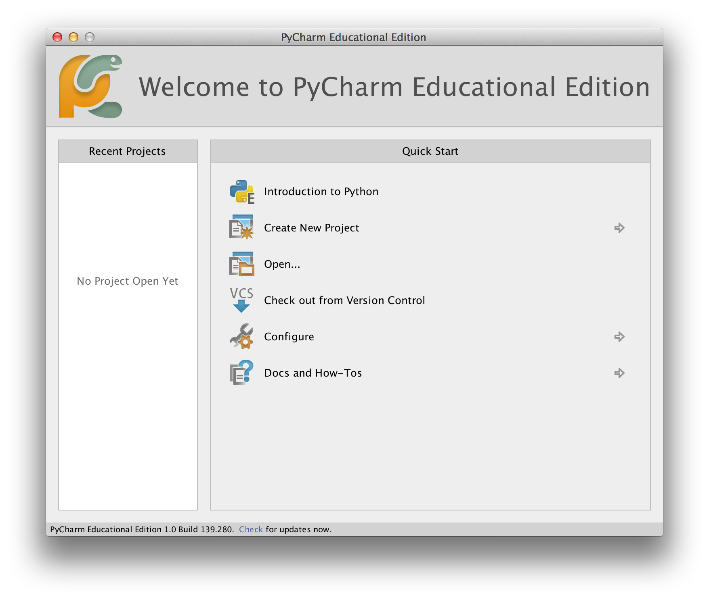
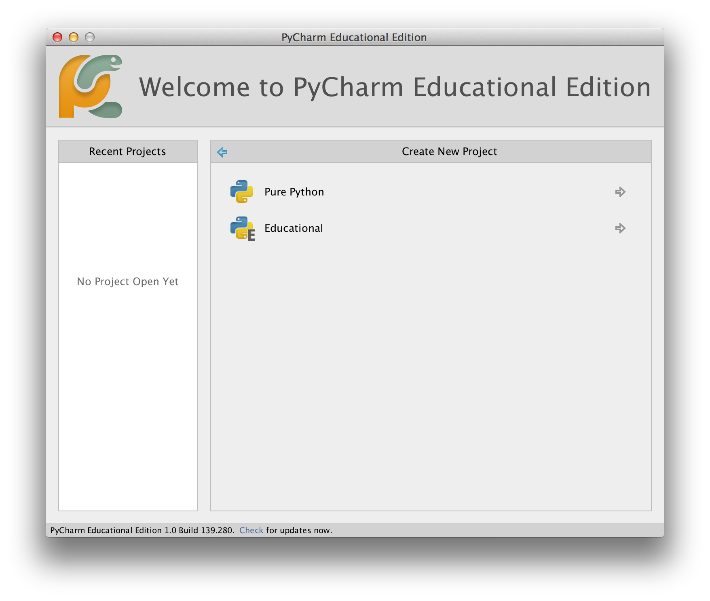
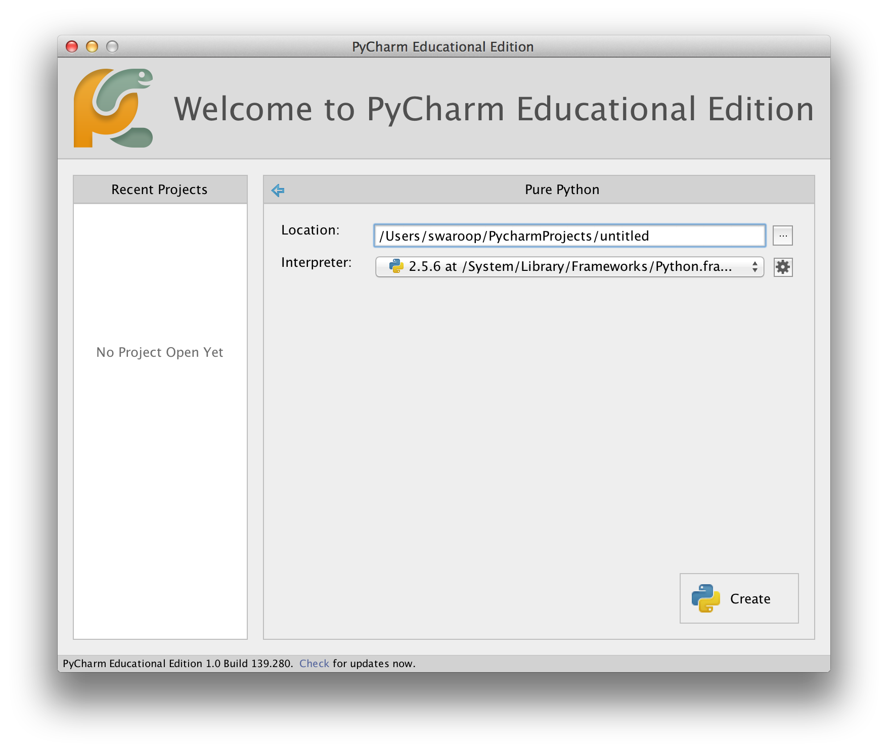
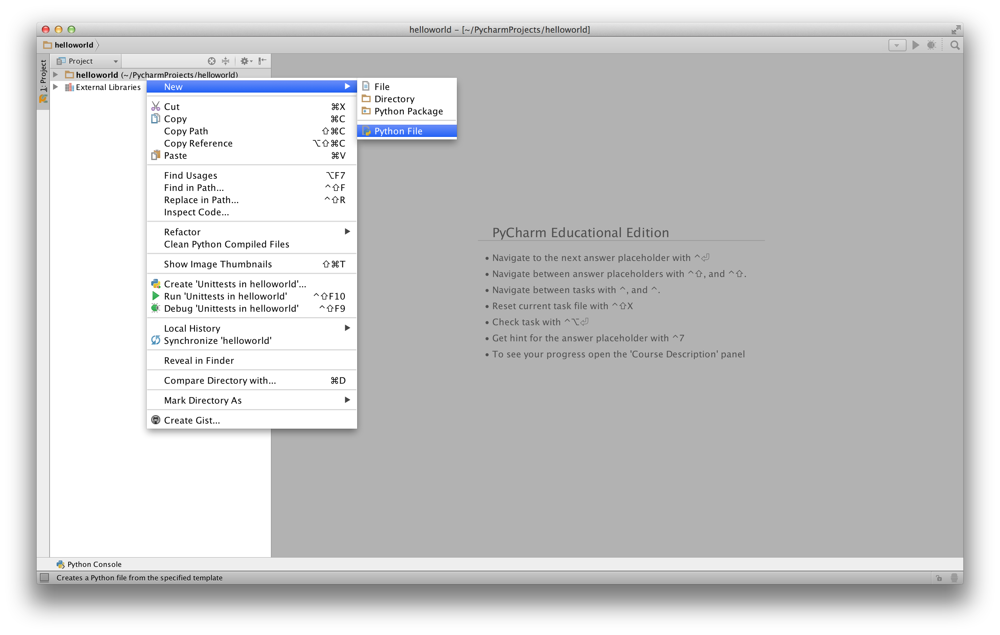
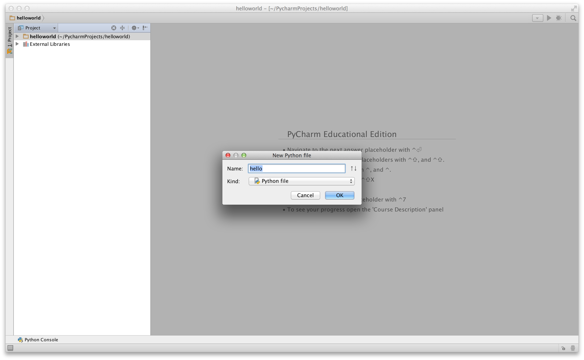
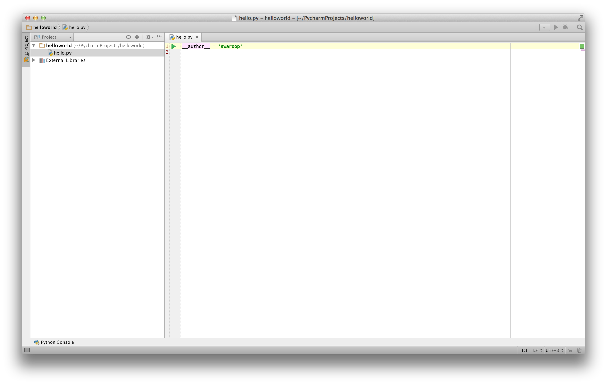
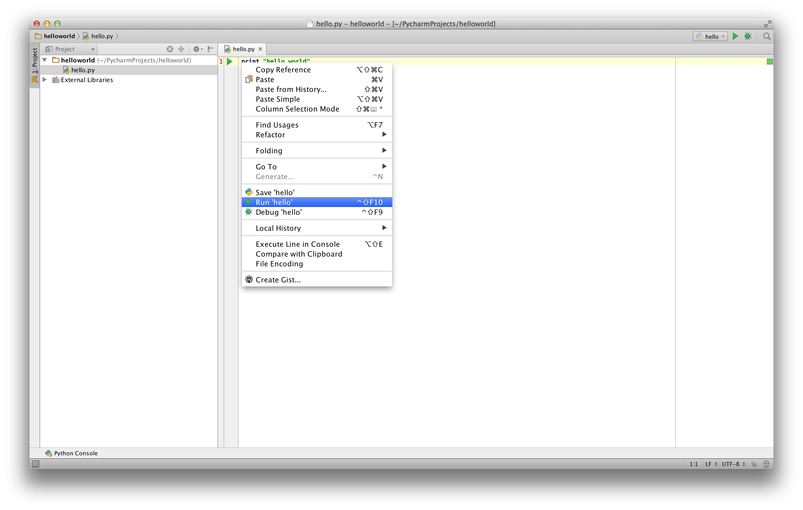
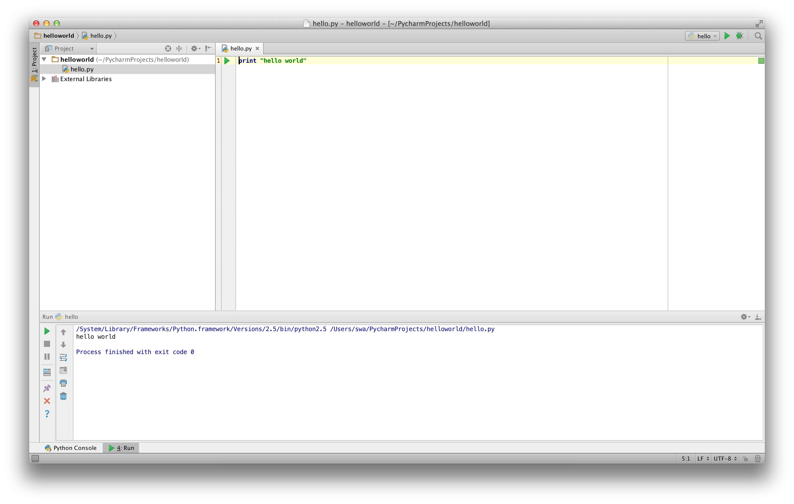
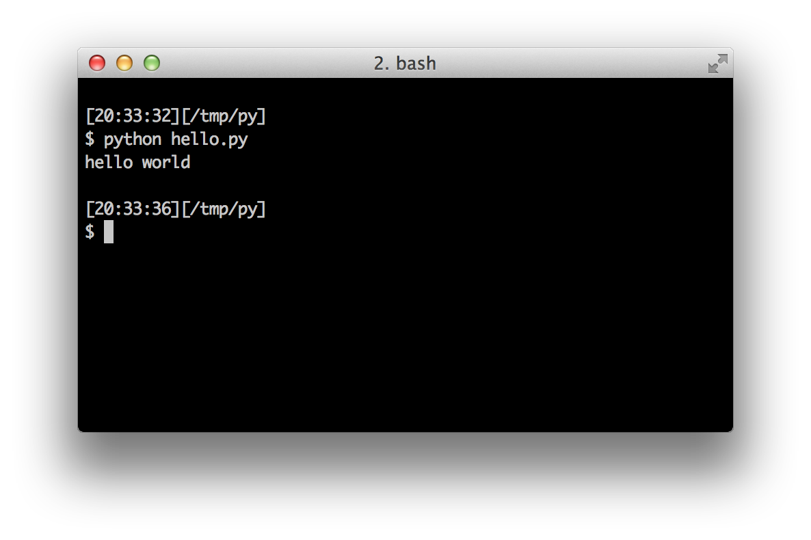

# Перші кроки

Давайте подивимося, як створити традиційну програму «Привіт,Світ!» на Python. Це навчить вас писати, зберігати та запускати програми Python.

Є два способи використання Python для запуску вашої програми - використання інтерактивного запрошення інтерпретатора та використання файлу з текстом програми. Зараз ми побачимо, як використовувати обидва ці методи.

## Використання командного рядка інтерпретатора (англ. "Using The Interpreter Prompt")

Відкрийте вікно термінала у вашій операційній системі (як описано раніше в розділі [Інсталяція] [Installation](./installation.md#installation) ) і запустіть інтерпретатор Python, ввівши команду `python3`та натиснувши клавішу`[enter]`.

Щойно ви запустите Python, ви побачите `>>>>, де ви можете почати вводити текст.Це називається _командний рядок інтерпретатора Python_(англ." _Python interpreter prompt_").

У командному рядку інтерпретатора Python введіть:

```python
print("Привіт, Світ!")
```

після чого натиснить клавішу `[enter]`. Ви повинні побачити на екрані слова  `Привіт, Світ!`.

The details about the Python software will differ based on your computer, but the part from the prompt (i.e. from `>>>` onwards) should be the same regardless of the operating system.Ось приклад того, що ви повинні бачити під час використання комп’ютера Mac OS X. Інформація о версії програмного забезпечення Python  може відрізнятися залежно від вашого комп’ютера, але частина командного рядка (тобто від `>>>` і далі) має бути однаковою незалежно від операційної системи.

<!-- Вихід має відповідати змінній pythonVersion variable in book.json -->

```
$ python3
Python 3.6.0 (default, Jan 12 2017, 11:26:36)
[GCC 4.2.1 Compatible Apple LLVM 8.0.0 (clang-800.0.38)] on darwin
Type "help", "copyright", "credits" or "license" for more information.
>>> print("Привіт, Світ!")
Привіт, Світ!
```

Зауважте, що Python миттєво дає вам результат рядка! Те, що ви щойно ввели, є одиночним _оператором_ Python. Ми використовуємо `print`, щоб (як це не дивно) надрукувати будь-яке значення, яке ви йому надаєте. Тут ми надаємо текст «Привіт, Світ!», і він негайно друкується на екрані.

### Як вийти з командного рядка інтерпретатора (англ." How to Quit the Interpreter Prompt")

If you are using a GNU/Linux or OS X shell,

Якщо ви використовуєте оболонку GNU/Linux або OS X, ви можете вийти з командного рядка підказки інтерпретатора, натиснувши `[ctrl + d]` або ввівши `exit()` (примітка: не забудьте включити дужки, `()`) за допомогою клавіші `[enter]`.

Якщо ви використовуєте командний рядок Windows, натисніть `[ctrl + z]`, а потім клавішу `[enter]`.

## Вибір редактора (англ." Choosing An Editor")

Оскільки ми не можемо набирати програму в командному рядку інтерпретатора щоразу, коли нам потрібно щось запустити, нам доведеться зберігати програми в
файлах, щоб потім мати можливість запускати їх скільки завгодно разів.

Перш ніж приступити до написання програм на Python у файлах, нам потрібний редактор
для роботи із файлами програм. Вибір редактора дуже важливий. Підходити до вибору редактора треба так само, як і до вибору особистого автомобіля. Хороший редактор допоможе
вам легко писати програми на Python, роблячи вашу подорож більш комфортною, а
також дозволяючи швидше та безпечніше досягти вашої мети.

Одна з основних вимог є _підсвічування синтаксису_, коли різні елементи
програми на Python розфарбовані так, щоб ви могли легко _бачити_ вашу програму та
хід виконання.

Якщо ви не знаєте, з чого почати, я б порекомендував використовувати програмне забезпечення [PyCharm Educational Edition](https://www.jetbrains.com/pycharm-edu/), яке доступне для Windows, Mac OS X і GNU/Linux. Подробиці в наступному розділі.

Якщо ви використовуєте Windows, *не використовуйте Блокнот* - це поганий вибір, оскільки в нього не має функції підсвічування синтаксису,а також  він не дозволяє вставляти відступи, що дуже важливо у нашому випадку, як ми побачимо пізніше. Хороші редактори зроблять це автоматично.

Якщо ви досвідчений програміст, ви повинні вже використовувати [Vim](http://www.vim.org) або [Emacs](http://www.gnu.org/software/emacs/). Зайве говорити, що це два найпотужніші редактори, і ви отримаєте користь від їх використання для написання своїх програм на Python. Я особисто використовую обидва для більшості своїх програм і навіть написав [цілу книгу про Vim](https://vim.swaroopch.com/).


Якщо ви бажаєте витратити час на вивчення Vim або Emacs, я настійно рекомендую вам навчитися використовувати будь-який з них, оскільки це буде дуже корисно для вас у довгостроковій перспективі. Однак, як я вже згадував раніше, початківці можуть почати з PyCharm і зосередити навчання на Python, а не на редакторі на даний момент.

Повторюю, будь ласка, виберіть відповідний редактор - це може зробити написання програм Python веселішим і легшим.

Якщо ви зацікавлені в детальному обговоренні цієї теми, перегляньте [Пошук ідеального редактора коду Python](https://realpython.com/courses/finding-perfect-python-code-editor/).

## PyCharm {#pycharm}

[PyCharm Educational Edition](https://www.jetbrains.com/pycharm-edu/) is a free editor which you can use for writing Python programs.

When you open PyCharm, you'll see this, click on `Create New Project`:



Select `Pure Python`:



Change `untitled` to `helloworld` as the location of the project, you should see details similar to this:



Click the `Create` button.

Right-click on the `helloworld` in the sidebar and select `New` -> `Python File`:



You will be asked to type the name, type `hello`:



You can now see a file opened for you:



Delete the lines that are already present, and now type the following:

<!-- TODO: Update screenshots for Python 3 -->

```python
print("hello world")
```
Now right-click on what you typed (without selecting the text), and click on `Run 'hello'`.



You should now see the output (what it prints) of your program:



Phew! That was quite a few steps to get started, but henceforth, every time we ask you to create a new file, remember to just right-click on `helloworld` on the left -> `New` -> `Python File` and continue the same steps to type and run as shown above.

You can find more information about PyCharm in the [PyCharm Quickstart](https://www.jetbrains.com/pycharm-educational/quickstart/) page.

## Vim

1. Install [Vim](http://www.vim.org)
    * Mac OS X users should install `macvim` package via [HomeBrew](http://brew.sh/)
    * Windows users should download the "self-installing executable" from [Vim website](http://www.vim.org/download.php)
    * GNU/Linux users should get Vim from their distribution's software repositories, e.g. Debian and Ubuntu users can install the `vim` package.
2. Install [jedi-vim](https://github.com/davidhalter/jedi-vim) plugin for autocompletion.
3. Install corresponding `jedi` python package : `pip install -U jedi`

## Emacs

1. Install [Emacs 24+](http://www.gnu.org/software/emacs/).
    * Mac OS X users should get Emacs from http://emacsformacosx.com
    * Windows users should get Emacs from http://ftp.gnu.org/gnu/emacs/windows/
    * GNU/Linux users should get Emacs from their distribution's software repositories, e.g. Debian and Ubuntu users can install the `emacs24` package.
2. Install [ELPY](https://github.com/jorgenschaefer/elpy/wiki)

## Using A Source File

Now let's get back to programming. There is a tradition that whenever you learn a new programming language, the first program that you write and run is the 'Hello World' program - all it does is just say 'Hello World' when you run it. As Simon Cozens[^1] says, it is the "traditional incantation to the programming gods to help you learn the language better."

Start your choice of editor, enter the following program and save it as `hello.py`.

If you are using PyCharm, we have already [discussed how to run from a source file](#pycharm).

For other editors, open a new file `hello.py` and type this:

```python
print("hello world")
```

Where should you save the file? To any folder for which you know the location of the folder. If you
don't understand what that means, create a new folder and use that location to save and run all
your Python programs:

- `/tmp/py` on Mac OS X
- `/tmp/py` on GNU/Linux
- `C:\py` on Windows

To create the above folder (for the operating system you are using), use the `mkdir` command in the terminal, for example, `mkdir /tmp/py`.

IMPORTANT: Always ensure that you give it the file extension of `.py`, for example, `foo.py`.

To run your Python program:

1. Open a terminal window (see the previous [Installation](./installation.md#installation) chapter on how to do that)
2. **C**hange **d**irectory to where you saved the file, for example, `cd /tmp/py`
3. Run the program by entering the command `python hello.py`. The output is as shown below.

```
$ python hello.py
hello world
```



If you got the output as shown above, congratulations! - you have successfully run your first Python program. You have successfully crossed the hardest part of learning programming, which is, getting started with your first program!

In case you got an error, please type the above program _exactly_ as shown above and run the program again. Note that Python is case-sensitive i.e. `print` is not the same as `Print` - note the lowercase `p` in the former and the uppercase `P` in the latter. Also, ensure there are no spaces or tabs before the first character in each line - we will see [why this is important](./basics.md#indentation) later.

**How It Works**

A Python program is composed of _statements_. In our first program, we have only one statement. In this statement, we call the `print` _statement_ to which we supply the text "hello world".

## Getting Help

If you need quick information about any function or statement in Python, then you can use the built-in `help` functionality. This is very useful especially when using the interpreter prompt. For example, run `help('len')` - this displays the help for the `len` function which is used to count number of items.

TIP: Press `q` to exit the help.

Similarly, you can obtain information about almost anything in Python. Use `help()` to learn more about using `help` itself!

In case you need to get help for operators like `return`, then you need to put those inside quotes such as `help('return')` so that Python doesn't get confused on what we're trying to do.

## Summary

You should now be able to write, save and run Python programs at ease.

Now that you are a Python user, let's learn some more Python concepts.

---

[^1]: the author of the amazing 'Beginning Perl' book
