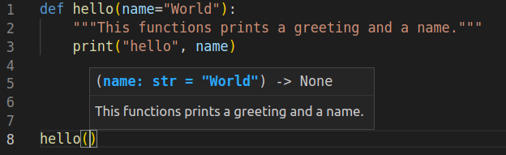

# Функції 

Функції — є багаторазовими фрагментами програми. Вони дозволяють вам дати назву блоку рядків коду, щоб згодом запускати цей блок, використовуючи вказане ім’я будь-де у вашій програмі та будь-яку кількість разів. Це називається *викликом* функції. Ми вже використовували багато вбудованих функцій, таких як `len` і `range`.

Концепція функції є, ймовірно, *найважливішим* будівельним блоком будь-якого нетривіального програмного забезпечення (на будь-якій мові програмування), тому ми розглянемо різні аспекти функцій у цій главі.

Функції визначаються за допомогою ключового слова `def`. Для того щоб створити функцію потрібно розмістити ключове слово def перед ідентифікатором функції (її ім’ям), потім вказати пару дужок всередині яких можуть міститися імена змінних,поставити в кінці рядка двокрапку, яка закінчує рядок. Далі йде блок рядків коду, які є частиною цієї функції. Приклад покаже, що це насправді дуже просто:
Приклад (зберегти як `function1.py`):

<!--<pre><code class="lang-python"></code></pre>

Output:

<pre><code></code></pre>-->

```python
def скажи_привіт():
    # блок, що належить функції
    print('привіт, Світ!')
# Кінець функції

скажи_привіт()  # виклик функції
скажи_привіт()  # ще один виклик функції
```
Висновок: 
```
$ python function1.py
привіт, Світ!
привіт, Світ!
```

**Як це працює**

Ми визначаємо функцію під назвою `скажи_привіт` використовуючи синтаксис, описаний вище. Ця функція не приймає параметрів і, отже, немає змінних, оголошених у дужках. Параметри функції – це деякі вхіднi дані, які ми можемо передати функції, щоб отримати відповідний їм результат.
Зверніть увагу, що ми можемо викликати ту саму функцію двічі, що означає, що нам не потрібно писати той самий код знову.

## Параметри функції

Функції можуть приймати параметри, тобто деякі значення, що передаються функції,щоб вона щось *зробила* з ними. Ці параметри схожі на змінні, за винятком того, що значення цих змінних вказуються при виклику функції, та під час роботи функції їм вже надано їх значення.

Параметри вказуються в парі круглих дужок при визначенні функції, розділені символом
коми. Коли ми викликаємо функцію, ми надаємо значення таким же чином. Зверніть увагу на термінологію: імена, наведені при визначенні функції, називаються *параметрами*, тоді як значення,які ви передаєте в функцію при її виклику, - називаються *аргументами*.

Приклад (зберегти як `function_param.py`):

<!--<pre><code class="lang-python"></code></pre>

Output:

<pre><code></code></pre>-->
```python
def print_max(a, b):
    if a > b:
        print(a, 'є максимальним')
    elif a == b:
        print(a, 'дорівнює', b)
    else:
        print(b, 'є максимальним')

# пряма передача значень
print_max(3, 4)

x = 5
y = 7
# передача змінних як аргументи
print_max(x, y)
```
Висновок: 
```
$ python function_param.py
4 є максимальним
7 є максимальним
```

**Як це працює**

Тут ми визначаємо функцію з назвою `print_max`,яка використовує два параметри з назвою `a` і `b`. Ми знаходимо більше число за допомогою простого  блоку  `if..else`, а потім друкуємо більше число.

Коли ми вперше викликаємо функцію `print_max`, ми безпосередньо передаємо числа як аргументи. У другому випадку ми викликаємо функцію зі змінними в якості аргументів. `print_max(x, y)` призначає значення аргумента `x` параметру `a`, а значення аргумента `y` - параметру `b`. Функція `print_max` працює однаково в обох випадках.

Приклад від перекладача:
(зберегти як `function_param1.py`):
```python
def ноутбук(текст="привіт ",кількість=2):
	print(текст*кількість)

ноутбук() # виклик функції без аргументів (використовуються аргументи за замовчуванням)
ноутбук("Toshiba ") #виклик функції лише з одним аргументом (аргументом за замовчуванням
#використовується для другого параметра)
ноутбук("Lenovo ", 8) # виклик функції з обома аргументами
```
Висновок: 
```
$ function_param1.py
привіт привіт 
Toshiba Toshiba 
Lenovo Lenovo Lenovo Lenovo Lenovo Lenovo Lenovo Lenovo
```
де:
1. у рядку коду " def ноутбук(текст="привіт ",кількість=2):" -
_текст_ та _кількість_ є параметрами;
2. у рядку коду  "ноутбук("Toshiba ")", "ноутбук("Lenovo ", 8)" - _Toshiba_, _Lenovo_, _8_ є аргументами.

## Локальні змінні

При оголошенні змінних всередині визначення функції, вони жодним чином не пов’язані з іншими змінними з такими ж іменами, які використовуються поза функцією, тобто імена змінних є *локальними* для функції. Це називається  *областю видимості* змінної. Область видимості всіх змінних обмежена блоком, де вони оголошені, починаючи з точки визначення імені.

Приклад (зберегти як `function_local.py`):

<!--<pre><code class="lang-python"></code></pre>

Output:

<pre><code></code></pre>-->
```python
x = 50


def func(x):
    print('x дорівнює', x)
    x = 2
    print('Заміна локального x на',x)


func(x)
print('x як і раніше', x)
```
Висновок: 
```
$ python function_local.py
x дорівнює 50
Заміна локального x на 2
x як і раніше 50
```

**Як це працює**

Коли ми вперше друкуємо  *значення*,наданого імені *x*, у першому рядку тіла  функції (`print('x дорівнює', x)`), Python використовує значення параметра, оголошене в основному блоці над визначенням функції(x = 50).

Далі ми присвоюємо `x` значення `2`. Лише в межах функції `x` тепер має значення `2`. У глобальній області `x` все ще має значення `50`. Ім’я  `x` є локальним для нашої функції. Отже, коли ми змінюємо значення `x` у функції, `x` визначене в основному блоці, залишається незмінним.

За допомогою останнього виклика функції `print` , ми відображаємо значення  `x`, яке  вказане в основному блоці, тим самим підтверджуючи, що воно не змінилося при локальному привласненні значення раніше викликаної функції.

## `Global` оператор (англ. "The `global` statement")

Щоб призначити деяке значення змінної, визначеної на вищому рівні програми (тобто не в якійсь області видимості, як функції або класи), необхідно повідомити Python, що ії ім’я не є локальним, а є `глобальним`. Ми робимо це за допомогою оператора `global`. Неможливо призначити значення змінній, визначеній поза функцією, без оператора `global`.

Можна використовувати вже існуючі значення змінних, визначених поза межами функції (за умови, що всередині функції не було оголошено змінної з таким жe ім'ям).
Однак це не заохочується, і цього слід уникати, оскільки читачеві програми стає незрозуміло, де знаходиться визначення цієї змінної. Використання оператора `global` дає зрозуміти, що змінна визначена в самому зовнішньому блоці.

Приклад (зберегти як `function_global.py`):

<!--<pre><code class="lang-python"></code></pre>

Output:

<pre><code></code></pre>-->
```python
x = 50


def func():
    global x

    print('x дорівнює', x)
    x = 2
    print('Глобальний x змінено на', x)


func()
print('Значення x є', x)
```
Висновок: 
```
$ python function_global.py
x дорівнює 50
Глобальний x змінено на 2
Значення x є 2
```

**Як це працює**

Оператор `global` використовується для оголошення того, що `x` є глобальною змінною, отже, коли ми присвоюємо значення `x` всередині функції, ця зміна позначиться на значенні змінної x в
основному блоці програми.

Ви можете вказати більше однієї глобальної змінної за допомогою того самого оператора `global`, наприклад: `global x, y, z`.

## Значення аргументів за замовчуванням (англ."Default Argument Values")

Для деяких функцій ви можете зробити деякі параметри *необов’язковими* та використовувати значення за замовчуванням на випадок, якщо користувач не хоче надавати для них значення. Це робиться за допомогою значень аргументів за замовчуванням. Ви можете вказати значення аргументів за замовчуванням, додавши до назви параметра у визначенні функції оператор присвоєння (`=`), для подальших значень за замовчуванням.

Зауважте, що значення аргументу за замовчуванням має бути константою. Точніше, значення аргументу за замовчуванням має бути незмінним (англ."immutable")- це детально пояснюється в наступних розділах. Наразі просто запам’ятайте це.

Приклад (зберегти як `function_default.py`):

<!--<pre><code class="lang-python"></code></pre>

Output:

<pre><code></code></pre>-->

```python
def висловлювання(повідомлення, кількість=1):
    print(повідомлення * кількість)

висловлювання('Привіт')
висловлювання('Світ', 5)
```
Висновок: 
```
$ python function_default.py
Привіт
СвітСвітСвітСвітСвіт
```
**Як це працює**

Функція під назвою `висловлювання` використовується для друку рядка стільки разів, скільки вказано. Якщо ми не надаємо значення, то за замовчуванням рядок друкується лише один раз. Ми досягаємо цього, вказуючи значення аргументу за замовчуванням `1` для параметра `кількість`.

Під час першого виклика функції `висловлювання` ми вказуємо лише рядок ('Привіт'), і він друкує рядок один раз. Під час другого виклика функції `висловлювання` ми вказуємо і рядок('Привіт'), і аргумент `5`, вказуючи, що ми хочемо *промовити* повідомлення рядка 5 разів.

> *Важливо*
> 
> Значення за замовчуванням  можуть мати лише параметри, що знаходяться в кінці списку параметрів.
> Таким чином, у списку параметрів функції параметр зі значенням за замовчуванням не може передувати параметру без
> значення за замовчуванням.
> 
> Це пов’язано з тим, що значення призначаються параметрам за позицією. Наприклад, `def func(a,
> b=5)` є дійсним, але `def func(a=5, b)` є *недійсним*.

##  Аргументи ключових слів ( англ."Keyword Arguments")

Якщо у вас є функції з багатьма параметрами, і ви хочете вказати при виклику функції лише деякі з них, тоді ви можете надати значення таким параметрам, назвавши їх - це називається *аргументи ключового слова* - у цьому випадку  для передачі аргументів функції використовується ім'я (ключ) замість позиції (як було досі).

Є дві переваги такого підходу: ​​одна полягає в тому, що використовувати функцію легше, оскільки нам не потрібно турбуватися про порядок аргументів. По-друге, ми можемо надавати значення лише тим параметрам, яким ми хочемо, за умови, що інші параметри мають значення аргументів за замовчуванням.

Приклад (зберегти як `function_keyword.py`):

<!--<pre><code class="lang-python"></code></pre>

Output:

<pre><code></code></pre>-->

```python
def func(a, b=5, c=10):
    print('a дорівнює', a, ' b дорівнює', b, ' c дорівнює', c)

func(3, 7)
func(25, c=24)
func(c=50, a=100)
```
Висновок: 
```
$ python function_keyword.py
a дорівнює 3, b дорівнює 7, c дорівнює 10
a дорівнює 25, b дорівнює 5, c дорівнює 24
a дорівнює 100, b дорівнює 5, c дорівнює 50
```
**Як це працює**

Функція з назвою `func` має один параметр без значення за замовчуванням, а потім два параметри зі значеннями за замовчуванням.

Під час першого виклику, `func(3, 7)`, параметр `a` отримує значення `3`, параметр `b` отримує значення `7`, а `c` отримує значення за умовчанням `10`.

При другому виклику `func(25, c=24)` змінна `a` отримує значення 25 через позицію аргументу. Тоді параметр `c` отримує значення `24` завдяки іменуванню, тобто ключовим аргументам. Змінна "b" отримує  значення  за замовчуванням,рівне "5".

У третьому випадку використання `func(c=50, a=100)` ми використовуємо ключові аргументи для всіх вказаних значень. Зверніть увагу, що ми вказуємо значення для параметра `c` перед значенням `a`, хоча `a` визначено перед `c` у визначенні функції.

## Довільна кількість аргументів ( англ."VarArgs parameters" or "variable number of Arguments")

Іноді вам може знадобитися визначити функцію, яка може приймати _будь-яку_ кількість параметрів, тобто **змінну**кількість **аргументів**, цього можна досягти за допомогою зірочок (збережіть як `function_varargs.py`):

<!--<pre><code class="lang-python"></code></pre>

Output:

<pre><code></code></pre>-->
```python
 def підсумок(a=5, *номера, **телефонна_книга):
    print('a', a)
    
    #прохід по всіх елементах кортежу
    for один_елемент in номера:
        print('один_елемент', один_елемент)
        
    #прохід по всіх елементах словника  
    for перша_частина, друга_частина in телефонна_книга.items():
        print(перша_частина,друга_частина)

підсумок(10,1,2,3,Джек=1123,Джон=2231,Інге=1560)
```
Висновок: 
```
$ python function_varargs.py
a 10
один_елемент 1
один_елемент 2
один_елемент 3
Джек 1123
Джон 2231
Інге 1560

```
приклад англійською:
```python
def total(a=5, *numbers, **phonebook):
    print('a', a)
    
    #iterate through all the items in tuple
    for single_item in numbers:
        print('single_item', single_item)
        
    #iterate through all the items in dictionary    
    for first_part, second_part in phonebook.items():
        print(first_part,second_part)

total(10,1,2,3,Jack=1123,John=2231,Inge=1560)
```
Output:
```
$ python function_varargs.py
a 10
single_item 1
single_item 2
single_item 3
Jack 1123
John 2231
Inge 1560
```
**Як це працює**

Коли ми оголошуємо параметр із зірочкою, наприклад `*param`, тоді всі позиційні аргументи від цієї позиції і до кінця збираються в кортеж під назвою 'param'.

Подібним чином, коли ми оголошуємо параметр із подвійною зірочкою, наприклад `**param`, тоді всі аргументи ключового слова від цієї позиції і до кінця збираються як словник під назвою 'param'.

Ми досліджуватимемо кортежі та словники в [пізнішій главі](./data_structures.md#data-structures).


## Оператор "return" (англ."the `return` statement")

Оператор `return` використовується для *повернення* з функції, тобто для припинення її роботи та виходу з неї. За бажання ми також можемо *повернути значення* з функції.

Приклад (зберегти як `function_return.py`):

<!--<pre><code class="lang-python"></code></pre>

Output:

<pre><code></code></pre>-->
```python
def максимум(x, y):
    if x > y:
        return x
    elif x == y:
        return 'Числа рівні'
    else:
        return y

print(максимум(2, 3))
```
Output:
```
$ python function_return.py
3
```

**Як це працює**

Функція `максимум` повертає максимальний з двох параметрів, які в
даному випадку передаються їй під час виклику. Вона  використовує блок if..else для визначення найбільшого числа, а потім *повертає*  це число.

Зауважте, що оператор `return` без значення еквівалентний виразу `return None`. `None` — це спеціальний тип даних у Python, який представляє ніщо. Наприклад, він використовується, щоб вказати, що змінна не має значення, якщо вона має значення «None».

Кожна функція неявно містить оператор `return None` в кінці, якщо ви не написали власний оператор `return`. Ви можете побачити це, запустивши `print(some_function())`, де функція `some_function` не використовує оператор `return` у явному вигляді, наприклад:

```python
def some_function():
    pass
```

Оператор `pass` використовується в Python для позначення порожнього блоку команд.

> ПОРАДА: Існує вбудована функція під назвою `max`, яка вже реалізує функцію 'знайти максимум', тому використовуйте цю вбудовану функцію, коли це можливо.


## Рядки документації (англ." DocStrings")

У Python є чудова функція під назвою *рядки документації*, яку зазвичай називають коротшою назвою *DocStrings*. DocStrings є важливим інструментом, який вам слід використовувати, оскільки він допомагає краще документувати програму та полегшує її розуміння. Дивовижно, але ми навіть можемо отримати рядок документації, скажімо, з функції, коли програма фактично запущена!

Приклад (зберегти як `function_docstring.py`):

<!--<pre><code class="lang-python"></code></pre>

Output:

<pre><code></code></pre>-->
```python
def print_max(x, y):
    '''Виводить максимальне із двох чисел.

    Ці два значення мають бути цілими числами.'''
    # конвертувати в цілі числа, якщо можливо
    x = int(x)
    y = int(y)

    if x > y:
        print(x, 'найбільше')
    else:
        print(y, 'найбільше')

print_max(3, 5)
print(print_max.__doc__)
```
Output:
```
$ python function_docstring.py
5 найбільше
Виводить максимальне із двох чисел.

    Ці два значення мають бути цілими числами.
```
**Як це працює**

Рядок у першому логічному рядку функції є *рядком документації* для цієї функції. Зверніть увагу, що DocStrings також застосовуються до [модулів](./modules.md#modules) та [класів](./oop.md#oop), про які ми дізнаємося у відповідних розділах.

Існує домовленість щодо написання рядків документації —  Їх прийнято розміщувати в багаторядковий рядок, де перший рядок починається з великої літери та закінчується крапкою. Потім другий рядок залишається порожнім, а потім іде детальне пояснення, починаючи з третього рядка. Вам *настійно рекомендовано* дотримуватися цієї домовленості для всіх ваших рядків документації зі всіма вашими нетривіальними функціями.

Ми можемо отримати доступ до рядка документації функції `print_max` за допомогою атрибута цієї функції(тобто імені, що належить їй)`__doc__` (зверніть увагу на *подвійне підкреслення*). Просто пам’ятайте, що Python розглядає *все* як об’єкт, включаючи функції. Ми дізнаємося більше про об’єкти в розділі про [класи](./oop.md#oop).

Якщо ви використовували функцію `help()` в Python, то ви вже бачили використання рядків документації! Ця функція просто зчитує атрибут `__doc__` відповідної функції та акуратно виводить його на екран.Ви можете перевірити її на розглянутій
вище функції: просто увімкніть `help(print_max)` у текст програми. Не забудьте натиснути клавішу `q`, щоб вийти з `довідки`.

Так само автоматизовані інструменти можуть отримувати документацію з вашої програми. Тому я *настійно рекомендую* використовувати рядки документів для будь-якої нетривіальної функції, яку ви пишете. Команда `pydoc`, яка постачається з пакетом Python, працює подібно до `help()`, використовуючи рядки документації.

Приклад для «автоматизованих інструментів» від перекладача:
 Редактор коду «Visual Studio Code» може зрозуміти, що таке рядок документації (рядок 2) функції, і відобразити його в маленькому полі над курсором, коли ім’я функції вводиться (рядок 8 ) (див. знімок екрана нижче):



*Screenshot of Visual Studio Code displaying a docstring*


## Резюме

Ми розглянули доволі багато аспектів функцій, але зауважте, що ми ще не охопили всі їх аспекти. Однак ми вже розглянули більшість того, що ви будете використовувати щодо функцій Python щодня.

Далі ми побачимо, як використовувати та створювати модулі Python.
